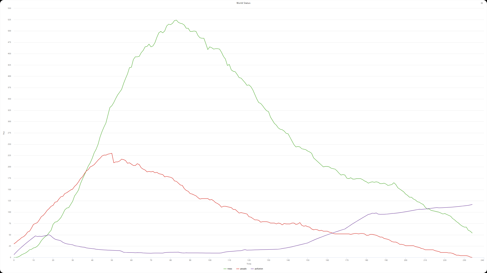
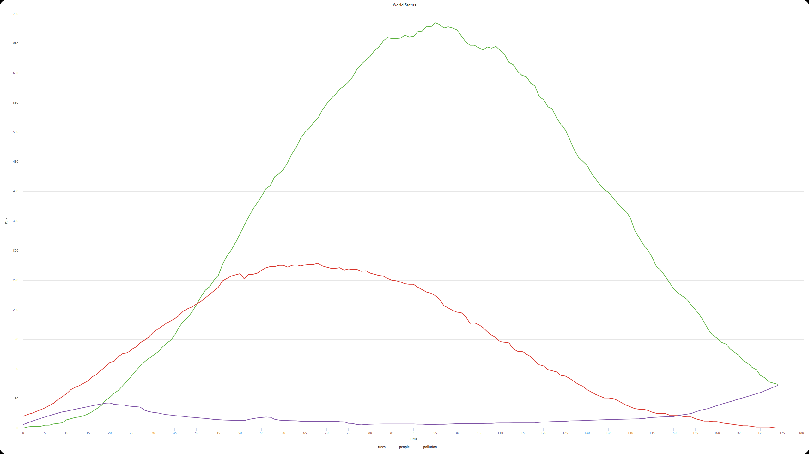
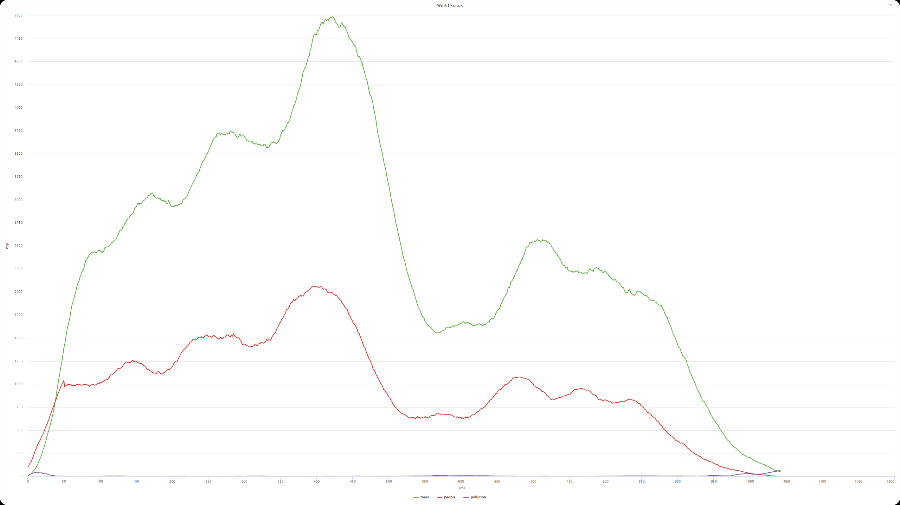
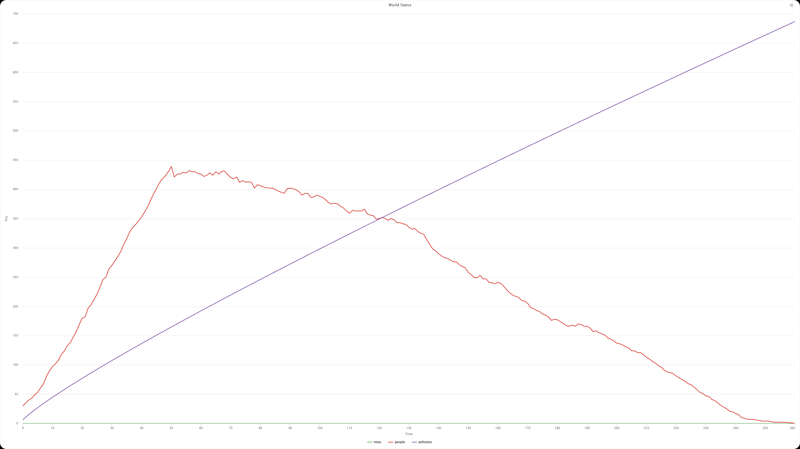
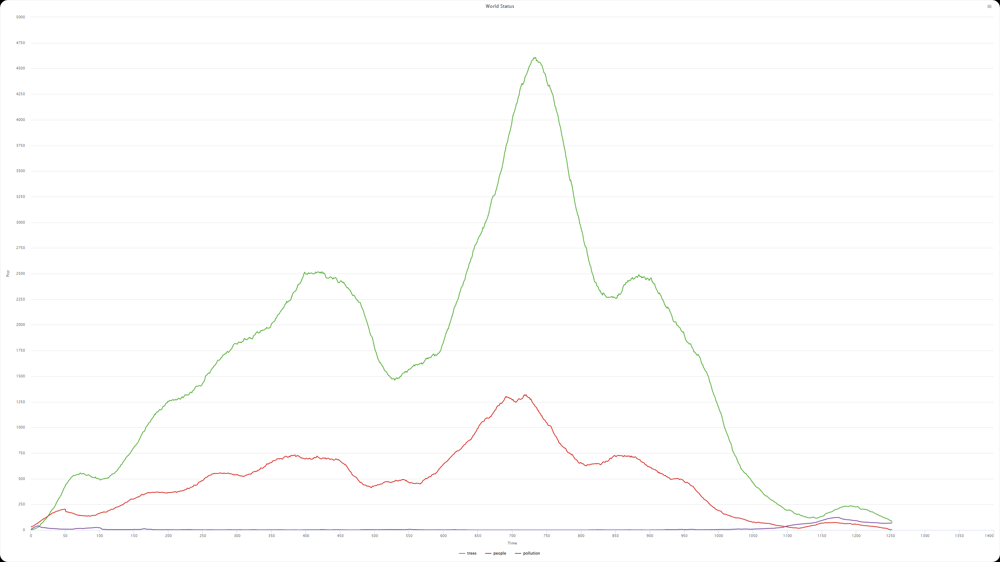
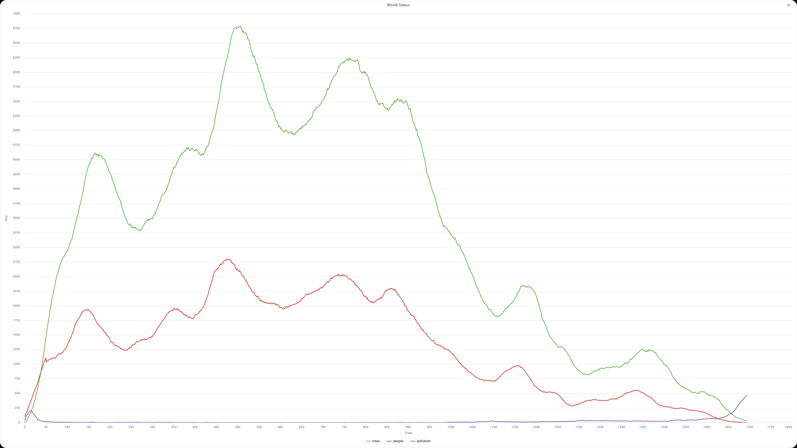

## Комп'ютерні системи імітаційного моделювання
## СПм-24-1, **Середа Сергій Сергійович**
### Лабораторна робота №**1**. Опис імітаційних моделей та проведення обчислювальних експериментів

### Варіант 17, модель у середовищі NetLogo:
[Urban Suite - Pollution](https://www.netlogoweb.org/launch#http://www.netlogoweb.org/assets/modelslib/Curricular%20Models/Urban%20Suite/Urban%20Suite%20-%20Pollution.nlogo)

 

### Вербальний опис моделі:
Ця модель симулює взаємодію між популяцією людей, забрудненням навколишнього середовища, що генерується електростанціями, та деревами, які допомагають поглинати це забруднення. Вона дозволяє побачити, як зміна параметрів (наприклад, рівня забруднення або швидкості посадки дерев) впливає на виживання популяції людей з часом.

### Параметри моделі:
- **INITIAL-POPULATION**: Встановлює початкову кількість людей у світі.
- **BIRTH-RATE**: Визначає ймовірність того, що людина народить нащадка за один тік.
- **PLANTING-RATE**: Визначає ймовірність того, що людина посадить дерево за один тік.
- **POWER-PLANTS**: Кількість електростанцій, що створюються.
- **POLLUTING-RATE**: Кількість забруднення, яку кожна електростанція генерує за один тік.

### Показники роботи системи:
- Кількість людей та дерев;
- Загальний рівень забруднення;
- Час виживання популяції у роках.

### Примітки:
Графік WORLD STATUS допомагає візуалізувати динаміку системи, показуючи, як змінюються кількість людей, дерев та рівень забруднення з часом.

### Недоліки моделі:
- Кількість електростанцій фіксується на початку і не змінюється, незалежно від потреби людей;
- Люди не намагаються уникати зон з високим рівнем забруднення;
- Дерева не розмножуються самостійно, а лише садяться людьми.

 

## Обчислювальні експерименти
### 1. Вплив кількості електростанцій та рівня забруднення
| № ітерації | **power-plants** | **polluting-rate** |
| :--- | :---: | :---: |
| **1** | 2 | 3 |
| **2** | 4 | 3 |
| **3** | 1 | 5 |

Рисунок 1.1 - ітерація 1

Рисунок 1.2 - ітерація 2

Рисунок 1.3 - ітерація 3

Як видно на графіках 1.1 - 1.3, збільшення кількості електростанцій та рівня забруднення призводить до швидшого зниження чисельності населення. 
У першій ітерації з меншою кількістю електростанцій та помірним рівнем забруднення населення виживає довше, тоді як у другій ітерації з більшою кількістю електростанцій населення скорочується швидше через підвищений рівень забруднення. 
У третій ітерації, де рівень забруднення є найвищим, населення гине найшвидше.

### 2. Вплив початкової кількості населення
| № ітерації | **initial-population** |
| :--- | :---: |
| **1** | 20 |
| **2** | 60 |
| **3** | 100 |

Рисунок 2.1 - ітерація 1

Рисунок 2.2 - ітерація 2

Рисунок 2.3 - ітерація 3

Як видно на графіках 2.1 - 2.3, початкова кількість населення має значний вплив на динаміку популяції. 
У першій ітерації з меншою початковою кількістю населення населення швидко вичерпується. 
У другій ітерації з більшою початковою кількістю населення населення виживає довше, але все ж таки знижується через забруднення. 
У третій ітерації з найбільшою початковою кількістю населення населення має найкращі шанси на виживання, але все одно піддається впливу забруднення.

### 3. Вплив швидкості посадки дерев
| № ітерації | **planting-rate** |
| :--- | :---: |
| **1** | 0 |
| **2** | 0.03 |
| **3** | 0.07 |

Рисунок 3.1 - ітерація 1

Рисунок 3.2 - ітерація 2

Рисунок 3.3 - ітерація 3

Як видно на графіках 3.1 - 3.3, швидкість посадки дерев має позитивний вплив на зниження рівня забруднення. 
У першій ітерації без посадки дерев рівень забруднення зростає швидко, що призводить до швидкого зниження населення. 
У другій ітерації з помірною швидкістю посадки дерев рівень забруднення зростає повільніше, що дозволяє населенню вижити довше. 
У третій ітерації з високою швидкістю посадки дерев рівень забруднення значно знижується, що сприяє кращим умовам для виживання населення.

### 4. Вплив швидкості народжуваності
| № ітерації | **initial-population** | **birth-rate** | **planting-rate** | **power-plants** | **polluting-rate** |
| :--- | :---: | :---: | :---: | :---: | :---: |
| **1** | 100 | 0.1 | 0.05 | 10 | 3 |
| **2** | 100 | 0.11 | 0.05 | 10 | 3 |
| **3** | 100 | 0.11 | 0.01 | 20 | 5 |

Рисунок 4.1 - ітерація 1

Рисунок 4.2 - ітерація 2

Рисунок 4.3 - ітерація 3

Як видно на графіках 4.1 - 4.3, модель не оптимальна при зміненні швидкості народжуваності. 
У першій ітерації з базовою швидкістю народжуваності населення поступово знижується. 
У другій ітерації, з підвищеною швидкістю народжуваності, модель починає зависати через завелику кількість людей (>20к). 
У третій ітерації, з більшою кількістю електростанцій та рівнем забруднення, модель все одно зависає, що свідчить про її обмежену здатність адекватно реагувати на зміну параметру народжуваності.

## Висновки:
Проведені обчислювальні експерименти показали, що параметри моделі мають значний вплив на динаміку популяції людей та рівень забруднення навколишнього середовища. Зокрема, збільшення кількості електростанцій та рівня забруднення призводить до швидшого зниження чисельності населення. Початкова кількість населення також відіграє важливу роль: більша початкова кількість дозволяє вижити довше, але не гарантує стабільності в умовах високого забруднення. Швидкість посадки дерев позитивно впливає на зниження рівня забруднення, що сприяє кращим умовам для виживання людей. Нарешті, підвищення швидкості народжуваності може допомогти компенсувати втрати населення, але лише за умови контролю рівня забруднення. Загалом, модель демонструє важливість балансу між людською діяльністю та станом навколишнього середовища для забезпечення сталого розвитку.