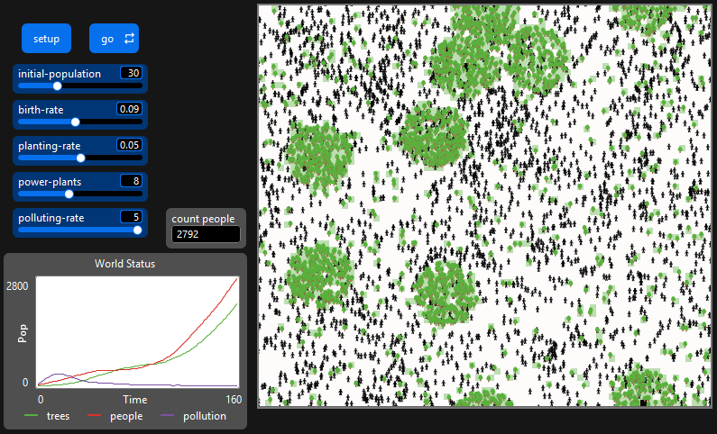
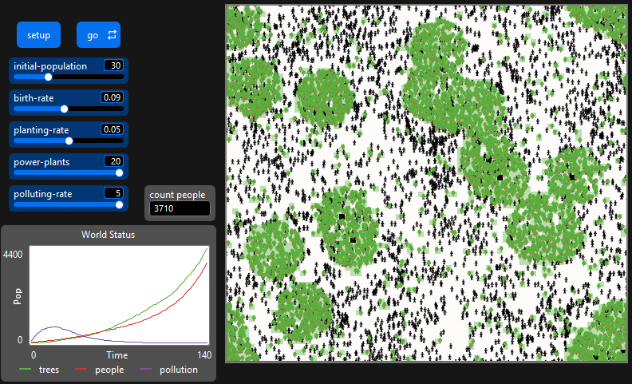
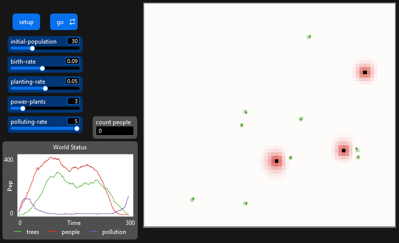
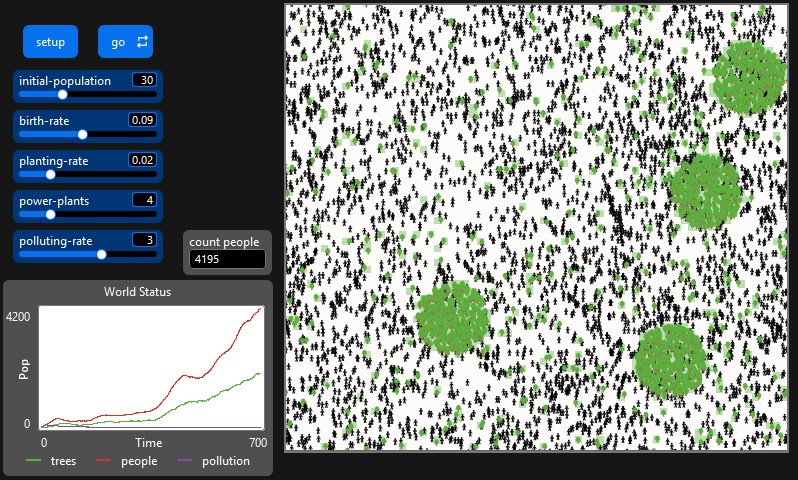
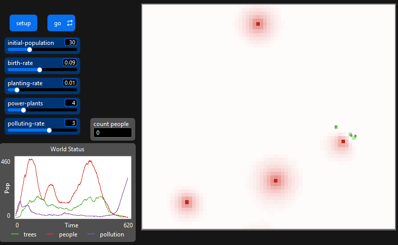
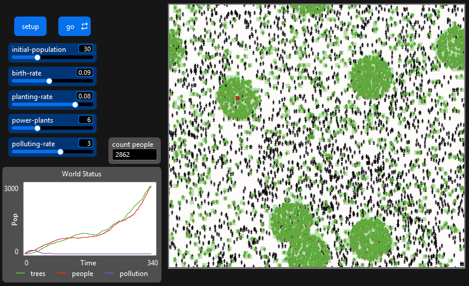

## Комп'ютерні системи імітаційного моделювання
## СПм-24-1, **Середа Сергій Сергійович**
### Лабораторна робота №2. Редагування імітаційних моделей у середовищі NetLogo

### Варіант 17, модель у середовищі NetLogo:
[Urban Suite - Pollution](https://www.netlogoweb.org/launch#http://www.netlogoweb.org/assets/modelslib/Curricular%20Models/Urban%20Suite/Urban%20Suite%20-%20Pollution.nlogo) 

Реалізувати позитивний вплив наявності на імітаційному полі електростанцій на вірогідність появи нових людей. Збільшити вірогідність висадки дерев у клітинах поблизу електростанцій.

 

### Внесені зміни у вихідну логіку моделі:
1. Позитивний вплив наявності електростанцій на вірогідність появи нових людей реалізовано шляхом збільшення коефіцієнта народжуваності (birth-rate) на 0.05 (5%) за кожну електростанцію в радіусі 8 клітин від людини.

Зміна в reproduce:   До:
<pre>
to reproduce  ;; person procedure
  if health > 4 and random-float 1 < birth-rate [
    hatch-people 1 [
      set health 5
    ]
  ]
end
</pre>

Після:
<pre>
to reproduce  ;; person procedure 
  let current-birth-rate birth-rate ;; локальна змінна для шансу народження

  ;; якщо в радіусі 8 клітин є електростанція, підвищуємо шанс народження
  if any? patches in-radius 8 with [is-power-plant?] [
    set current-birth-rate current-birth-rate + 0.05 ;; плюс 5% до шансу
  ]

  ;; змінюємо birth-rate на current-birth-rate
  if health > 4 and random-float 1 < current-birth-rate [
    hatch-people 1 [
      set health 5
    ]
  ]
end
</pre>

2. Вирогідність висадки дерев у клітинах поблизу електростанцій збільшено на 0.1 (10%) за кожну електростанцію в межах радіусу 5 клітин.

Зміна в maybe-plant:   До:
<pre>
to maybe-plant  ;; person procedure
  if random-float 1 < planting-rate [
    hatch-trees 1 [
      set health 5
      set color green
    ]
  ]
end
</pre>

Після:
<pre>
to maybe-plant  ;; person procedure
  let current-planting-rate planting-rate ;; локальна змінна для шансу посадки

  ;; збільшуємо вірогідність висадки дерев поблизу електростанцій
  if any? patches in-radius 5 with [is-power-plant?] [
    set current-planting-rate current-planting-rate + 0.10 ;; збільшуємо шанс на 10%
  ]

  ;; змінюємо planting-rate на current-planting-rate
  if random-float 1 < current-planting-rate [
    hatch-trees 1 [
      set health 5
      set color green
    ]
  ]
end
</pre>

### Внесені зміни у вихідну логіку моделі, на власний розсуд:
1. Тепер дерево втрачатиме здоров'я не лише від часу, а й пропорційно до рівня забруднення на клітині.

Зміна в cleanup:   До:
<pre>
to cleanup  ;; tree procedure
  set pcolor green + 3
  set pollution max (list 0 (pollution - 1))
  ask neighbors [
    set pollution max (list 0 (pollution - .5))
  ]
  set health health - 0.1
end
</pre>

Після:
<pre>
to cleanup  ;; tree procedure
  set pcolor green + 3
  set pollution max (list 0 (pollution - 1))
  ask neighbors [
    set pollution max (list 0 (pollution - .5))
  ]
  set health health - 0.1

  ;; Якщо забруднення на клітині більше 0.5 - дерево починає повільно вмирати, чим більше забруднення, тим швидше вмирає дерево.
  if pollution > 0.5 [
    set health health - (pollution / 4) ;; ділимо на 4, щоб ефект був не миттєвим
  ]
end
</pre>

2. Зробимо так, щоб базова вірогідність висадки дерев (далеко від станцій) була низькою, а біля станцій залишалась високою.

Зміна в maybe-plant:   До:
<pre>
to maybe-plant  ;; person procedure
  let current-planting-rate planting-rate ;; локальна змінна для шансу посадки

  ;; збільшуємо вірогідність висадки дерев поблизу електростанцій
  if any? patches in-radius 5 with [is-power-plant?] [
    set current-planting-rate current-planting-rate + 0.10 ;; збільшуємо шанс на 10%
  ]

  ;; змінюємо planting-rate на current-planting-rate
  if random-float 1 < current-planting-rate [
    hatch-trees 1 [
      set health 5
      set color green
    ]
  ]
end
</pre>

Після:
<pre>
to maybe-plant  ;; person procedure
  let current-planting-rate planting-rate / 10 ;; локальна змінна для шансу посадки поділена на 10

  ;; збільшуємо вірогідність висадки дерев поблизу електростанцій
  if any? patches in-radius 5 with [is-power-plant?] [
    set current-planting-rate planting-rate + 0.10 ;; якщо поруч є електростанція, відновлюємо базовий шанс та збільшуємо його на 10%
  ]

  ;; змінюємо planting-rate на current-planting-rate
  if random-float 1 < current-planting-rate [
    hatch-trees 1 [
      set health 5
      set color green
    ]
  ]
end
</pre>

 

## Обчислювальні експерименти
### 1. Вплив кількості електростанцій та рівня забруднення

 Рисунок 1.1 - ітерація 1

 Рисунок 1.2 - ітерація 2

 Рисунок 1.3 - ітерація 3

Як видно на графіках 1.1 - 1.3, наявність електростанцій має позитивний вплив на народжуваність населення та висадку дерев, що сприяє виживанню населення.

### 2. Вплив швидкості посадки дерев

 Рисунок 2.1 - ітерація 1

 Рисунок 2.2 - ітерація 2

 Рисунок 2.3 - ітерація 3

Як видно на графіках 2.1 - 2.3, швидкість посадки дерев значно впливає на висадку дерев далеко від електростанцій, що мало впливає на загальний рівень забруднення.

## Висновки:
Під час виконання лабораторної роботи було внесено зміни до моделі "Urban Suite - Pollution" у середовищі NetLogo, що дозволили дослідити вплив електростанцій на населення та рослинність. Проведені обчислювальні експерименти показали, що наявність електростанцій сприяє збільшенню народжуваності та висадці дерев, що позитивно впливає на екологічний стан моделі. Зміни в логіці моделі дозволили краще відобразити взаємозв'язки між забрудненням, населенням та рослинністю.