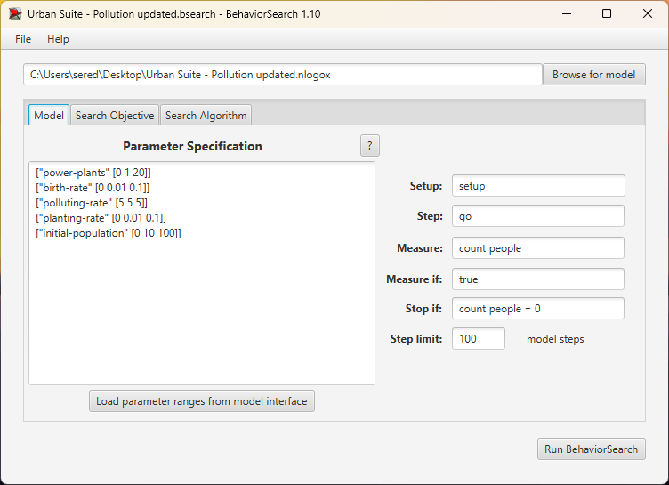
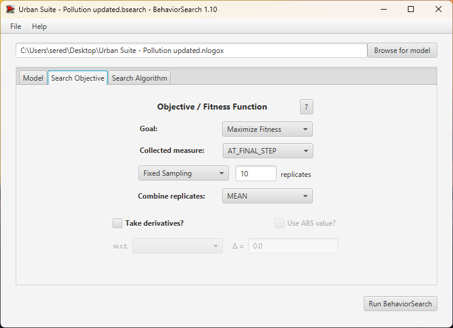
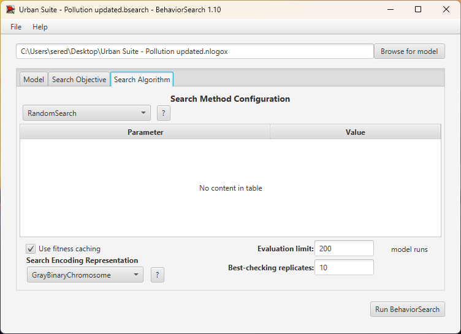
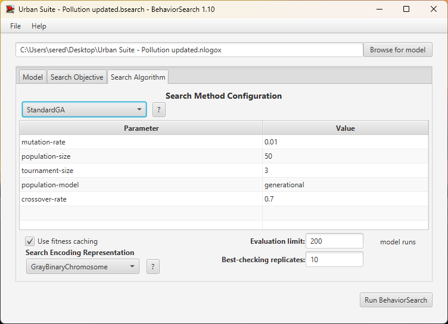
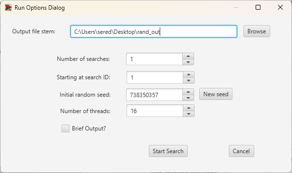
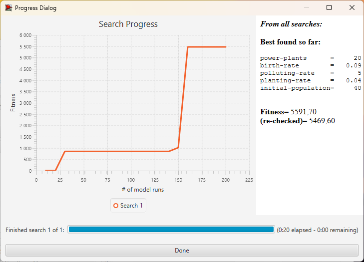
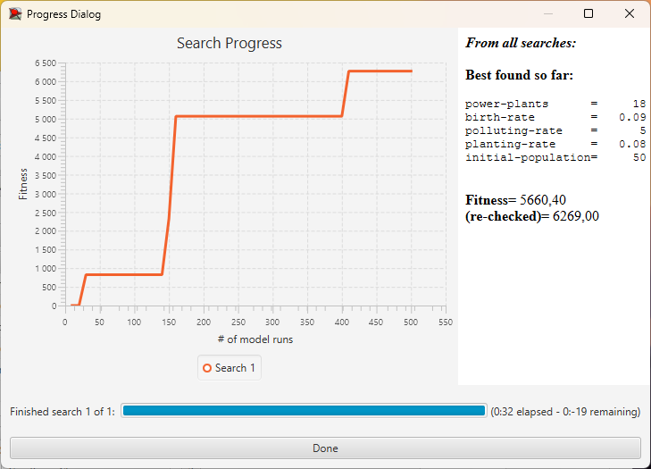
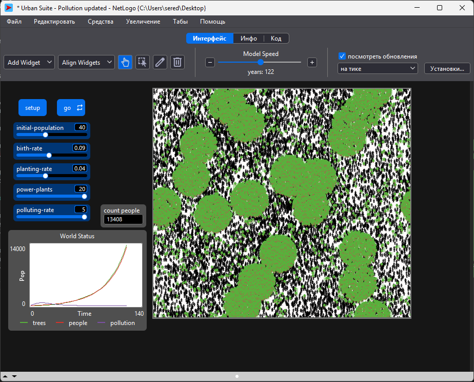
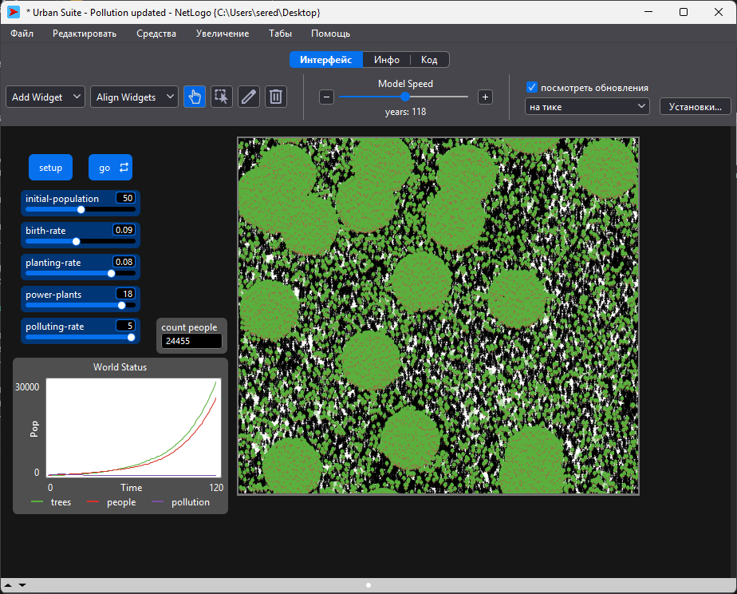

## Комп'ютерні системи імітаційного моделювання
## СПм-24-1, **Середа Сергій Сергійович**
### Лабораторна робота №3. Використання засобів обчислювального інтелекту для оптимізації імітаційних моделей

### Варіант 17, модель у середовищі NetLogo:
[Urban Suite - Pollution](https://www.netlogoweb.org/launch#http://www.netlogoweb.org/assets/modelslib/Curricular%20Models/Urban%20Suite/Urban%20Suite%20-%20Pollution.nlogo) 
 

### Вербальний опис моделі:
Модель є імітацією екосистеми міста, що відтворює взаємодію між людською популяцією, зеленими насадженнями та джерелами забруднення. У системі електростанції виступають постійними генераторами забруднення, знижуючи рівень здоров'я людей. Люди реагують наступним чином: поблизу електростанцій спостерігається підвищена народжуваність, а також значно інтенсивніша висадка дерев, що імітує спроби екологічної компенсації у промислових зонах. Дерева знижують забруднення, але при перевищенні критичного рівня вони гинуть пришвидшеними темпами.

Ці процеси формують хиткий екологічний баланс, де здатність дерев очищати повітря постійно протистоїть впливу електростанцій. Модель дозволяє аналізувати ефективність цільового озеленення в епіцентрах забруднення та спостерігати, чи зможе популяція вижити в умовах, коли засоби боротьби із забрудненням (дерева) знищуються самим забрудненням.

### Керуючі параметри:
- **initial-population** - початкова кількість людей у місті на момент запуску симуляції;
- **power-plants** - кількість електростанцій, що виступають джерелами забруднення;
- **polluting-rate** - рівень забруднення, що створюється електростанціями;
- **birth-rate** - базова вірогідність народження людини (автоматично збільшується на 5% у радіусі 8 клітин від електростанції);
- **planting-rate** - базова вірогідність висадки дерева людиною (зменшується у 10 разів у чистих зонах, але збільшується на 10% поблизу електростанцій).

### Показники роботи моделі:
- **Кількість населення (count people)**;
- **Кількість дерев (count trees)**;
- **Середній рівень забруднення (mean [pollution] of patches)**;
- **Середнє здоров'я населення (mean [health] of people)**.

### Налаштування середовища BehaviorSearch:
**Використана модель:** ***Urban Suite - Pollution updated.nlogox*** (Додано до репозиторію)

**Параметри моделі** (вкладка Model):
<pre>
["power-plants" [0 1 20]]
["birth-rate" [0 0.01 0.2]]
["polluting-rate" [0 1 5]]
["planting-rate" [0 0.01 0.1]]
["initial-population" [0 10 100]]
</pre>
Ці параметри автоматично вилучені середовищем BehaviorSearch.

**Мета**: максимізація кількості населення.

#### Налаштування Model:

- **Measure: _count people_** - це показник успіху, максимізація кількості живих людей;
- **Stop if: _count people = 0_** - якщо всі померли, немає сенсу продовжувати симуляцію;
- **Step limit: _100_** - скільки тіків триває одна симуляція.
 

#### Налаштування Search Objective:

- **Goal: _Maximize Fitness_** - мета це максимізація кількості людей;
- **Combine method: _at_final_step_** - оцінка проводиться в кінці симуляції.
 

#### Налаштування Search Algorithm:

- **Evaluation limit: _200_** - кількість симуляцій, які будуть виконані для пошуку оптимальних параметрів;
- **Best-cheking replicates: _10_** - кількість повторних симуляцій для кращих знайдених параметрів, щоб переконатися в їх стабільності.
 

### Результати використання BehaviorSearch:
Через занадто довгий час симуляції, були змінені параметри birth-rate та polluting-rate. Максимальне значення birth-rate було зменшено до 0.1, а polluting-rate зафіксовано на 5:
<pre>
["birth-rate" [0 0.01 0.1]]
["polluting-rate" [5 5 5]]
</pre>

Вікно запуску пошуку:

 

Результат пошуку параметрів імітаційної моделі, використовуючи випадковий пошук:

 

Результат пошуку параметрів імітаційної моделі, використовуючи генетичний алгоритм:

 

Порівняння результатів випадкового пошуку та генетичного алгоритму виявляє перевагу останнього, оскільки він дозволив досягти вищої кількості людей на полі. 
Якщо випадковий пошук зупинився на показнику fitness (re-checked) 5469, то генетичний алгоритм покращив цей результат до 6269.

Відмінність у кінцевих значеннях пояснюється різними комбінаціями параметрів, знайденими алгоритмами для виживання в агресивному середовищі. 
Випадковий пошук пропонує конфігурацію з критичним навантаженням: power-plants = 20, planting-rate = 0.04 та initial-population = 40. 
Натомість генетичний алгоритм знайшов більш ефективний баланс: при схожому рівні техногенного навантаження (power-plants = 18) він запропонував удвічі вищу інтенсивність відновлення екосистеми (planting-rate = 0.08) та більшу стартову популяцію (initial-population = 50). 
Саме вища активність у висадці дерев дозволила системі краще компенсувати вплив максимального забруднення (polluting-rate = 5), що забезпечило виживання більшої кількості людей.

Саме для цієї моделі генетичний алгоритм виявився значно результативнішим. 
Він зміг знайти стратегію протидії забрудненню, яка ефективніша за результат випадкового пошуку, підтверджуючи перевагу еволюційних методів у задачах пошуку балансу в динамічних екологічних системах.

### Перевірка коректності отриманих результатів у NetLogo:

Результат перевірки коректності Random Search:

Результат перевірки коректності Standard GA:

Для перевірки коректності отриманих результатів були використані найкращі параметри, знайдені кожним із алгоритмів. 
Параметри були введені вручну у модель NetLogo, тестування показало, що обидва алгоритми змогли досягти відповідних результатів по ефективності.

## Висновки:
Під час виконання лабораторної роботи було досліджено застосування методів обчислювального інтелекту для оптимізації параметрів імітаційної моделі в середовищі NetLogo. 
Було використано два підходи: випадковий пошук (Random Search) та генетичний алгоритм (Genetic Algorithm). 
Результати показали, що генетичний алгоритм значно перевершив випадковий пошук, дозволивши досягти вищої кількості населення в моделі. 
Це свідчить про ефективність еволюційних методів у пошуку оптимальних рішень в складних динамічних системах. 
Тестування отриманих параметрів у середовищі NetLogo підтвердило коректність результатів, що підкреслює практичну цінність використання обчислювального інтелекту для оптимізації імітаційних моделей.